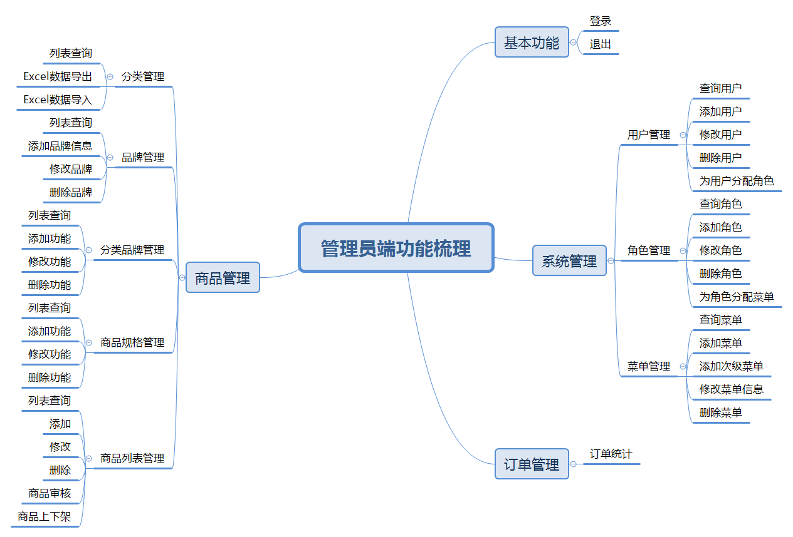
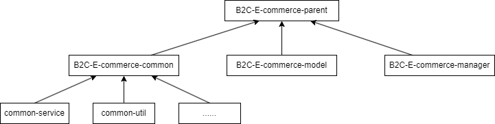
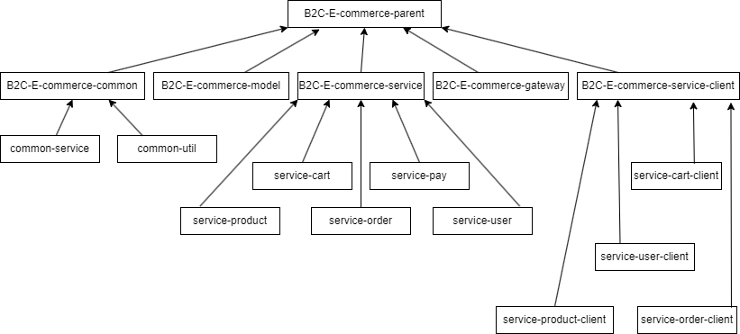

## B2C-E-commerce电子商务平台

> B2C-E-commerce电子商务平台，分为管理员端和用户端两个系统，采用前后端分离开发，管理员端采用单体架构（已完结），用户端采用微服务架构（开发中）。
> 现阶段仅实现了管理员端，用户端正在开发中，


### 项目使用技术栈：

* 后端：Spring Boot、Spring Cloud Alibaba、Redis、EasyExcel、Minio、短信平台、支付宝支付等
* 前端：[vue-element-admin开源框架](https://github.com/huzhushan/vue3-element-admin) 、Vue3、ES6、Node.js、NPM、Element Plus、ECharts等

### 功能梳理：

管理员端：

用户端：开发整理中...
### 工程模块简介：
#### 管理员端-后端工程结构


- B2C-E-commerce-parent:项目父工程，依赖统一管理，打包方式为pom  
- B2C-E-commerce-common:公共模块  
- common-service:公共服务模块  
- common-util:工具类模块  
- B2C-E-commerce-model:实体类模块  
- B2C-E-commerce-manager:管理员端-后端服务  

#### 用户端-后端工程结构



- 开发整理中

#### 整体概览

| 名称 | 描述 | 地址 | 状态 |  
|---|---|---|---|
| B2C-E-commerce-parent | 管理员端-后端 | [B2C-E-commerce-parent](https://github.com/xionghaotian525/B2C-E-commerce-parent) |已完成 |
| B2C-E-commerce-frontend | 管理员端-前端 | [B2C-E-commerce-frontend](https://github.com/xionghaotian525/B2C-E-commerce-frontend) |已完成 |
| B2C-E-commerce-parent | 用户端-后端 | [B2C-E-commerce-parent](https://github.com/xionghaotian525/B2C-E-commerce-parent) |开发中 |
| B2C-E-commerce-parent/res/h5 | 用户端-前端 | [B2C-E-commerce-parent/res/h5](https://github.com/xionghaotian525/B2C-E-commerce-parent) |已完成 |

### quickstart(管理员端)：
- 后端：

1.克隆项目
```
git clone https://github.com/xionghaotian525/B2C-E-commerce-parent.git
```

2.启动redis服务

```shell
#切换到redis安装路径，打开cmd
redis-server
```
3.启动minio服务([minio下载安装](https://blog.csdn.net/xiong_tai/article/details/139565353?spm=1001.2014.3001.5501))

```shell
E:\minio\bin\minio.exe server E:\minio\data --console-address ":9001" --address ":9000" > E:\minio\logs\minio.log
```

4.修改`B2C-E-commerce-parent/B2C-E-commerce-manager/src/main/resources/application-dev.yml`中的数据库连接信息

```yml
# 配置数据库连接信息
spring:
  datasource:
    type: com.zaxxer.hikari.HikariDataSource
    driver-class-name: com.mysql.cj.jdbc.Driver
    url: jdbc:mysql://localhost:3306/your_db_name?characterEncoding=utf-8&useSSL=false&allowPublicKeyRetrieval=true
    username: your_username
    password: your_password
```

5.启动后端服务ManagerApplication

- 前端

1.克隆项目
```shell
git clone https://github.com/xionghaotian525/B2C-E-commerce-frontend.git
```
2.安装依赖
```shell
npm install
```
3.启动前端服务
```shell
npm start
```
